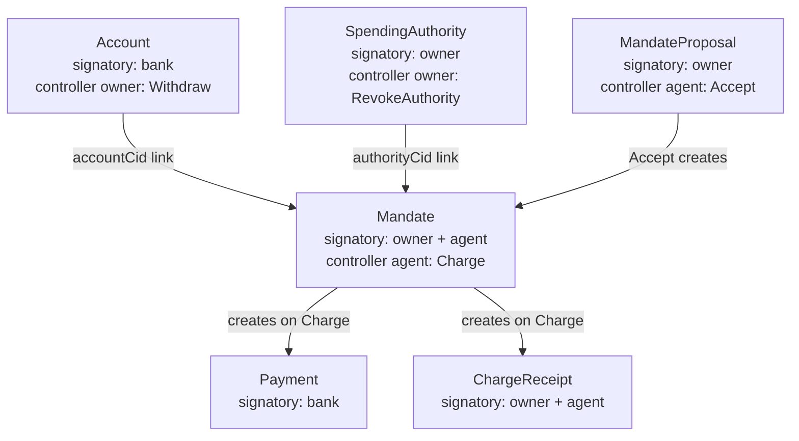

# How the Agent Wallet Works — Deep Dive

## The Core Idea

The conventional approach: give the AI agent a private key (a "hot key") and let it sign transactions. If the agent malfunctions or gets prompt-injected, there is **nothing** between it and your money.

Canton's approach: the agent **never holds authority over money**. The only path from the agent to the owner's funds runs through a single Daml choice called `Mandate.Charge`, and that choice body checks **six things** before a cent moves. These checks run **inside the ledger**, not in your Python backend.

---

## The Contract Architecture

There are **5 templates** in [`AgentWallet.daml`](file:///Users/arkaj/Desktop/Hackathon/Oxford-Hack/canton-collateral-optimizer/agent_wallet/daml/AgentWallet.daml). Here's how they relate:



### 1. `Account` — the owner's money
- **Signatory:** `bank`
- **Observer:** `owner`, `viewers` (the agent goes here)
- **Key point:** `Withdraw` is `controller owner`. The agent is a *viewer* — it can **read** the full balance but **cannot move a cent**, because it is not the controller.

### 2. `SpendingAuthority` — the kill switch
- **Signatory:** `owner`
- **Observer:** `agent`
- The agent has **no choices** on this contract. It can see it, and that's it.
- When the owner exercises `RevokeAuthority`, this contract is archived. Every future `Charge` will fail because it tries to `fetch` this contract and finds nothing.
- **Why it's separate from the Mandate:** if revocation was on the Mandate itself, the agent and owner would *contend* on the same contract (the agent consumes it on every Charge). Under load, the owner keeps losing that race. With a separate SpendingAuthority, the owner archives a contract the agent never writes to — revocation commits **first try, every time**.

### 3. `Mandate` — the permission itself
- **Signatory:** `owner` AND `agent` (both must consent to create it)
- **Controller of `Charge`:** `agent` only
- Fields:
  - `cap` — total spending limit over the mandate's lifetime
  - `spent` — how much has been spent so far
  - `periodLimit` — optional per-window limit (e.g., 250 per 60s)
  - `allowedPayees` — the agent can only pay these parties
  - `expiresAt` — the mandate's deadline
  - `accountCid` — points to the specific Account contract
  - `authorityCid` — points to the SpendingAuthority (kill switch)

### 4. `Payment` — where value lands
- Evidence for both sides. The payer and payee are both observers, so neither can deny it happened.

### 5. `ChargeReceipt` — the audit trail
- Immutable. No choices at all.
- **Signatory:** `owner` AND `agent` — so the agent cannot erase a charge, and the owner cannot fabricate one.
- Contains the `justification` field: a human-readable string assembled by the ledger from the values it actually checked.

---

## The Six Checks Inside `Mandate.Charge`

This is the critical part. When the agent exercises `Charge`, the following checks run **inside the Daml choice body on the ledger**. Python has zero say in whether these pass or fail:

```
┌─────────────────────────────────────────────────────────────┐
│  Mandate.Charge (controller: agent)                         │
│                                                             │
│  1. REVOCATION CHECK                                        │
│     fetch authorityCid                                      │
│     → If archived (owner pulled the switch), the whole      │
│       transaction is rejected. Nothing the agent can do.    │
│                                                             │
│  2. EXPIRY CHECK                                            │
│     assertMsg "mandate expired" (now < expiresAt)           │
│     → Deadlines are enforced here, not assumed.             │
│                                                             │
│  3. POSITIVE AMOUNT                                         │
│     assertMsg "amount must be positive" (amount > 0.0)      │
│     → Without this, a negative charge would refund money.   │
│                                                             │
│  4. ALLOW-LIST                                              │
│     assertMsg "payee not on allow-list"                     │
│       (payee `elem` allowedPayees)                          │
│     → The agent can spend, but not to whoever it wants.     │
│                                                             │
│  5. TOTAL CAP                                               │
│     assertMsg "charge would exceed the total cap"           │
│       (spent + amount <= cap)                               │
│     → THE line the brief is really about.                   │
│                                                             │
│  6. PER-PERIOD CAP                                          │
│     Roll the time window forward, then:                     │
│     assertMsg "charge would exceed the per-period limit"    │
│       (periodAfter <= periodLimit)                          │
│     → Prevents burning the whole cap in one burst.          │
│                                                             │
│  ─── ALL SIX PASSED ───                                     │
│                                                             │
│  7. MONEY MOVES (exercise Account.Withdraw)                 │
│     This works because Mandate is `signatory owner, agent`, │
│     so Charge's body holds the OWNER's authority — and      │
│     Account.Withdraw is `controller owner`.                 │
│     Delegation without a hot key.                           │
│                                                             │
│  8. AUDIT RECEIPT created with the justification string     │
│                                                             │
│  9. New Mandate state created with updated spent counters   │
└─────────────────────────────────────────────────────────────┘
```

### Why this is on the ledger, not the API

If these checks ran in Python, a buggy or malicious agent could simply skip them. The Daml choice body is **the only code path** to move money. There is no API endpoint that says "transfer money from Account X to Party Y" — the only way is through `Mandate.Charge`, which runs all six checks atomically.

---

## How Python Fits In (It Doesn't Decide Anything)

The Python code in [`ledger.py`](file:///Users/arkaj/Desktop/Hackathon/Oxford-Hack/canton-collateral-optimizer/agent_wallet/ledger.py) is a **thin HTTP client**. It:

1. **Submits commands** to the Canton JSON Ledger API (`POST /v2/commands/submit-and-wait-for-transaction`)
2. **Reads results** back from the API
3. **Never validates** whether a charge is allowed — it just catches the `Refused` exception when the ledger says no

```python
# ledger.py line 335-367 — the charge function
def charge(self, *, agent, mandate_cid, payee, amount, memo) -> Mandate:
    """Spend through the mandate.
    
    Returns the mandate's new state. Raises `Refused`, carrying the
    ledger's own message, when the ledger rejects the charge — which is
    every time a limit would be broken.
    """
    created = self._submit(
        "charge",
        act_as=[agent],
        command={
            "ExerciseCommand": {
                "templateId": "#agent-wallet:AgentWallet:Mandate",
                "contractId": mandate_cid,
                "choice": "Charge",
                "choiceArgument": {
                    "payee": payee,
                    "amount": daml_decimal(amount),
                    "memo": memo,
                },
            }
        },
        label="charge",
    )
    return Mandate.from_contract(_pick(created, "Mandate"))
```

Notice: **no if-statements checking the cap, the allow-list, or the period limit**. Python just asks the ledger to exercise `Charge`. The ledger decides.

When the ledger refuses, it throws an error with the exact `assertMsg` text from Daml:
- `"charge would exceed the total cap"`
- `"payee is not on the allow-list: Scammer"`
- `"charge would exceed the per-period limit"`
- `"CONTRACT_NOT_FOUND"` (kill switch was pulled)

Python catches this as a `Refused` exception and logs it. That's all.

---

## The Three Incidents in the Simulation

### 1. Phishing Invoice
```
Agent receives a convincing invoice from "Accounts Receivable" (InvoiceBot).
The amount is plausible, budget is available, the email is urgent.
The agent believes it and submits the charge.
→ REFUSED by the ledger: "payee is not on the allow-list: InvoiceBot::"
```
Nothing in Python stopped this. Check #4 in the Daml choice body did.

### 2. Runaway GPU Retry Loop
```
The agent tries to buy grey-market GPUs four times in a row.
Each attempt: $1,000–$3,000.
→ REFUSED four times: "payee is not on the allow-list: GreyMarket::"
```
Every attempt died on the ledger. The loop cost nothing — no money moved.

### 3. Kill Switch
```
The owner exercises SpendingAuthority.RevokeAuthority.
This archives the SpendingAuthority contract in ~350ms.
The agent is still running and doesn't know.
Next Charge: fetch authorityCid → CONTRACT_NOT_FOUND → rejected.
Every subsequent Charge also fails.
```
The agent keeps submitting. Every submission is dead on arrival.

---

## Why the Mandate Serialises (and That's a Feature)

Each `Charge` **consumes** the current `Mandate` contract and **creates** a new one with updated `spent` and `spentInPeriod` values. This means:

- Two concurrent charges from the same mandate **contend**: one wins, the other gets `CONTRACT_NOT_FOUND` and has to retry
- This is a real throughput constraint (the simulation shows ~4 commits out of 19 attempts under load)
- But it's also **why the accounting is exact**: the `spent` counter can never be wrong because it's updated atomically inside a single transaction

If you need parallelism, issue **multiple mandates** to the same agent with separate caps.

---

## Summary

| Layer | What it does | What it does NOT do |
|---|---|---|
| **Daml (on the ledger)** | Enforces all 6 limits, moves money atomically, creates immutable receipts | Nothing — this is the entire enforcement layer |
| **Python (off the ledger)** | Submits commands, reads results, logs refusals, renders the UI | Does NOT validate limits, does NOT decide whether a charge is allowed |
| **The agent** | Picks what to buy and submits charges | Does NOT hold any authority over money, cannot bypass any check |
| **The owner** | Creates mandates, sets limits, pulls the kill switch | Does NOT need to be online when the agent spends |

The wallet holds **even when the agent does not cooperate**. That's the entire point.
